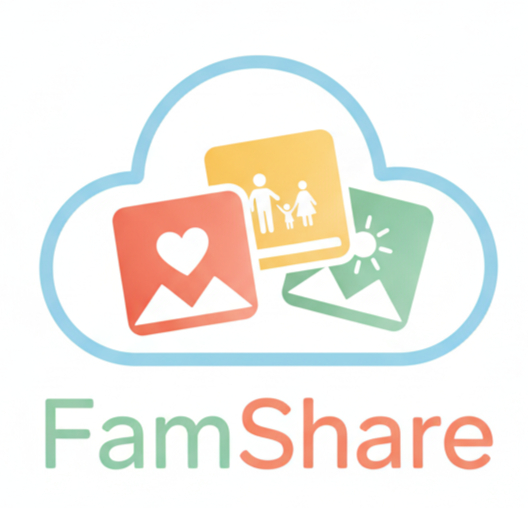

<center></center>

-------
# The FamShare Story: A JWT Security Series for developers

Welcome! This repository contains the source code for **FamShare**, a hands-on, story-driven web application designed to demonstrate common security vulnerabilities. 

This project follows the journey of a developer building a photo-sharing app for his family. Each "episode" introduces a new feature and a corresponding security flaw.

These vulnerabilities are brought to light in two ways: some are discovered by the developer's tech-savvy cousin, **Adam**, who acts as a friendly (but relentless) penetration tester. Others, however, are exploited by an anonymous, malicious attacker, raising the stakes from a simple bug to a critical security incident and forcing the developer to confront real-world threats.

The goal is to provide a practical, step-by-step guide for developers to learn how to implement security correctly by first understanding how it can be broken.

This project is built with **Go** and the **Fiber** framework on the backend, with a simple HTML, CSS, and vanilla **JavaScript** frontend. Feel free to follow along, break the app yourself, and learn how to fortify it.

### Vulnerabilities We Will Tackle:

* **Episode 1: Trusting the cookie** - Episode 1: The MVP Lie - Setting the stage for our security journey, this episode introduces the application with its first, critical vulnerability. This insecure cookie system serves as the inciting incident for the whole story! [....Read More Here](/Episode01.md)


## How to run FamShare v0.1

*(Go is required)*

```golang
git clone https://github.com/wbelguidoum/famshare.git
cd famshare
go run .
```

